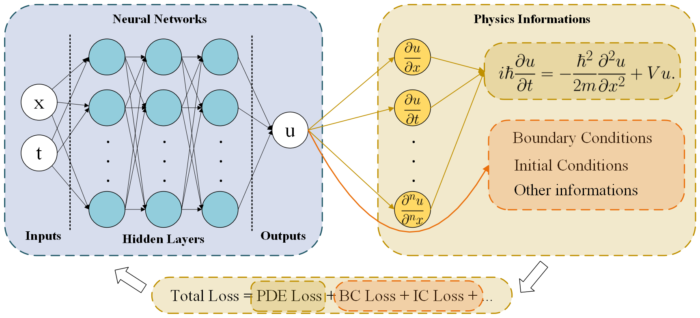
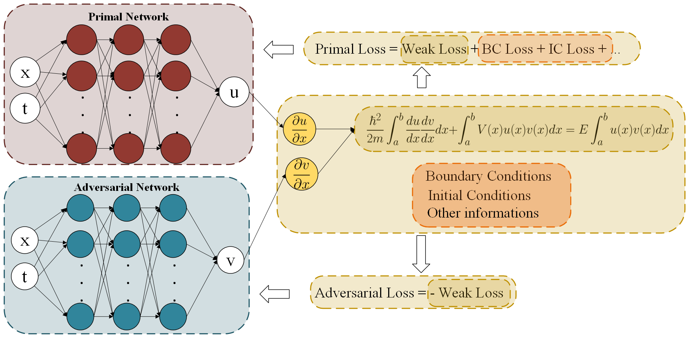
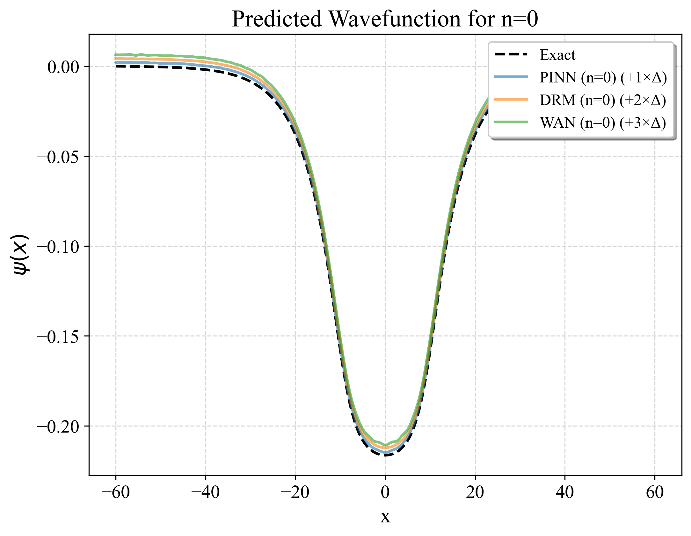
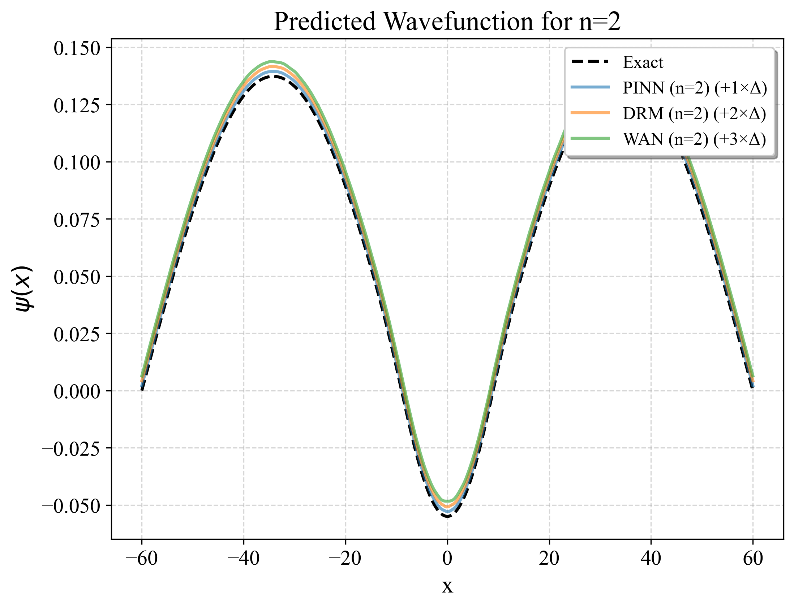
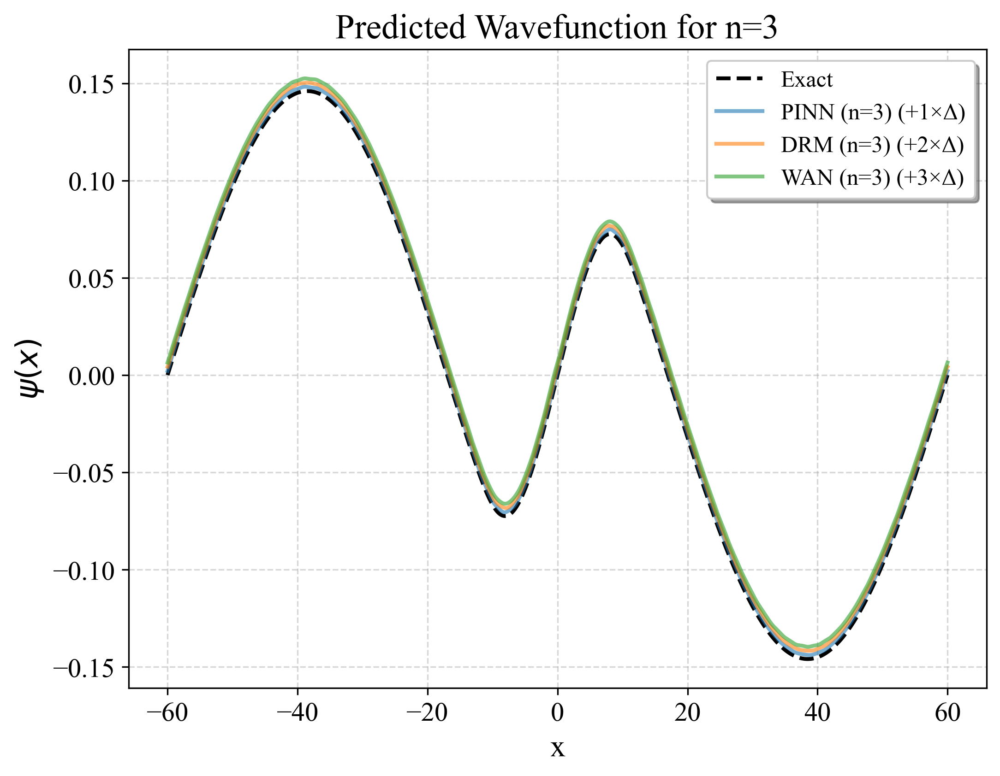

# Neural-Network-Based-PDE-Solver
This project explores how neural networks can be used to approximate solutions of partial differential equations (PDEs). Traditional numerical solvers rely on mesh‑based discretisations and domain‑specific techniques; in contrast, the methods implemented here embed the governing equations and boundary/initial conditions directly into the loss functions of neural networks. By leveraging automatic differentiation, these models learn to satisfy the physics of the problem while remaining flexible and mesh‑free. The repository was originally developed for an MSc Machine Learning final project and implements several modern neural‑PDE approaches, including Physics‑Informed Neural Networks (PINN), the Deep Ritz method (DRM) and Weighted Adversarial Networks (WAN)

## Features and methodologies
### Physics‑Informed Neural Networks (PINN)
PINNs approximate the solution of a PDE using a fully connected neural network. Automatic differentiation is used to evaluate derivatives of the network output; these are substituted into the PDE to form a residual loss. Boundary and initial conditions are enforced either through additional loss terms or by constructing the network output so that the conditions are satisfied identically.



### Deep Ritz Method (DRM)
The Deep Ritz method minimises the energy functional corresponding to a variational formulation of the PDE. For the Poisson equation the energy functional is defined as an integral of the gradient of the solution and the source term. The implementation computes the gradient of the network output and forms the energy density 0.5 * |grad(u)|^2 - f * u

### Weak Adversarial Network (WAN)
WAN introduces a second network that learns test functions to generate a weak formulation of the PDE. The primal network u and the adversarial network v engage in a minimax game: u minimises the weak residual while v maximises it subject to regularisation.




## Problems solved

| Equation                              | Implementations                                      | Description                                                                                                                                                                                                                                                                               |
| ------------------------------------- | ---------------------------------------------------- | ----------------------------------------------------------------------------------------------------------------------------------------------------------------------------------------------------------------------------------------------------------------------------------------- |
| **Poisson equation**                  | `Poisson_Equations/Poisson_ND.py`                    | Solves `-Δu = f` on `[0,L]^d` with either Dirichlet or Neumann boundary conditions.  The script supports one to five dimensions and allows choice of method (`PINN`, `DRM` or `WAN`).  The code defines the residual and energy loss functions and trains the neural networks accordingly. |
| **Infinite potential well**           | `Schrodinger_Equations/Infinite_Potential_Well`      | Computes stationary states of the Schrödinger equation in a one‑ or two‑dimensional infinite square well.  Scripts are provided for PINN+DRM (`IPW_1D_PINN_DRM.py`), WAN (`IPW_1D_WAN.py`), WAN with finite‑norm regularisation (`IPW_1D_WAN_FN.py`) and a 2‑D solver (`IPW_2D.py`).      |
| **Kramers–Henneberger (KH) equation** | `Schrodinger_Equations/Kramers_Henneberger/KH_1D.py` | Solves the time‑dependent Schrödinger equation in the Kramers–Henneberger frame.  The script includes an effective potential and uses the WAN formalism.                                                                                                                                  |
| **Quantum harmonic oscillator (QHO)** | `Schrodinger_Equations/Quantum_Harmonic_Oscillator`  | Contains solvers for the 1‑D QHO using PINN/DRM (`QHO_1D_PINN_DRM.py`), WAN (`QHO_1D_WAN.py`) and 2‑D variants (`QHO_2D.py`, `QHO_2D_Energy.py`).  These scripts compute eigenfunctions and, in the energy versions, minimise the energy functional analogous to the Deep Ritz method.    |


## Repository structure
```text
Neural-Network-Based-PDE-Solver/
├─ Data_process/
│  ├─ plot.py
│  └─ results_process.py
├─ Poisson_Equations/
│  └─ Poisson_1D.py
├─ Schrodinger_Equations/
│  ├─ Infinite_Potential_Well/
│  │  ├─ IPW_1D_PINN_DRM.py
│  │  ├─ IPW_1D_WAN.py
│  │  ├─ IPW_1D_WAN_FN.py
│  │  └─ IPW_2D.py
│  ├─ Kramers_Henneberger/
│  │  └─ KH_1D.py
│  └─ Quantum_Harmonic_Oscillator/
│     ├─ QHO_1D_PINN_DRM.py
│     ├─ QHO_1D_WAN.py
│     ├─ QHO_2D.py
│     └─ QHO_2D_Energy.py
├─ Plots/
│  ├─ PINN_structure.png
│  └─ WAN_structure.png
├─ README.md
└─ LICENSE
```

## Installation (pip via `requirements.pip.txt`)

> This uses a **pip-only** subset of the environment. It’s great for CPU or simple GPU setups.
> If you need exact CUDA/driver versions or Conda-only packages, prefer `environment.yml`.

### 1) Create and activate a virtual environment
**Linux/macOS**
```bash
python3 -m venv .venv
source .venv/bin/activate
python -m pip install --upgrade pip setuptools wheel
```

**Windows**
```powershell
python -m venv .venv
.\.venv\Scripts\Activate.ps1
python -m pip install --upgrade pip setuptools wheel
```
### 2) Install Python dependencies
```bash
pip install -r requirements.pip.txt

```

## Usage

The detailed usage is represented in sub folders for each questions

## Results
Scripts in the `Data_process` folder help analyse and visualise training logs. `results_process.py` converts JSON logs into CSV tables for ablation studies. 

Here are some results used in my paper.

### 2D Infinite Potential Well
This is the `FN` prediction.

| |  | |

### KH Potential Predictions

| | |
|---|---|
|  |  |
|  |  |

## Contributing
Contributions are welcome! If you extend the solver to other PDEs, improve the training routine or add new visualisations, feel free to open a pull request. Please accompany code changes with documentation and, where appropriate, update the README. For questions or suggestions, open an issue on GitHub.

## License
This project is released under the MIT License (see LICENSE).